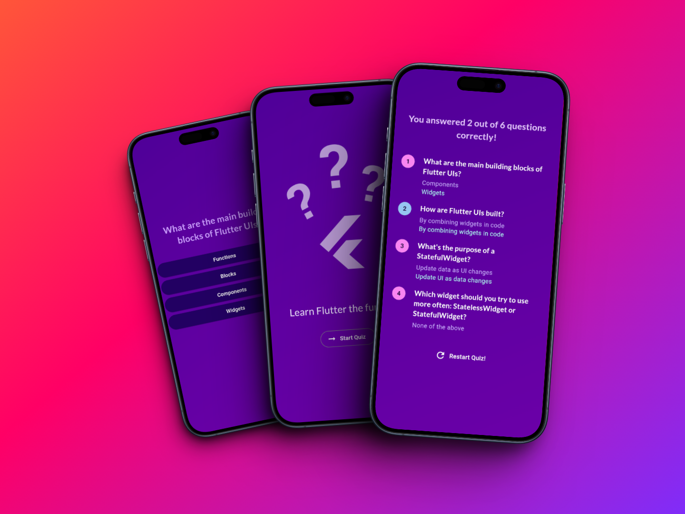

# Flutter Quiz App

## Overview

This app is designed to provide an interactive and enjoyable way for users to test their knowledge on Flutter but can be used to quiz on anything ideally. It features a clean UI, multiple question types, and a scoring system.

## Screenshots

Credit to my boy [Hakeem Alavi](https://github.com/HakeemAlavi) who showed me how to use [shots.so](https://shots.so/) for high quality project images and mockups. The guy is too clutch!

## Features

- One can adjust the data in the app and quiz on virtually any topic.
- The app features an automatic scoring system for the answers once a quiz is completed.
- The project explores core Flutter concepts such as widgets, state management and styling using Material UI.

## Acknowledgements

This project was inspired by the course ["Learn Flutter & Dart to Build iOS & Android Apps"](https://www.udemy.com/course/learn-flutter-dart-to-build-ios-android-apps/) by Academind by Maximilian Schwarzmüller. The course was instrumental in providing a solid foundation in Flutter app development.
